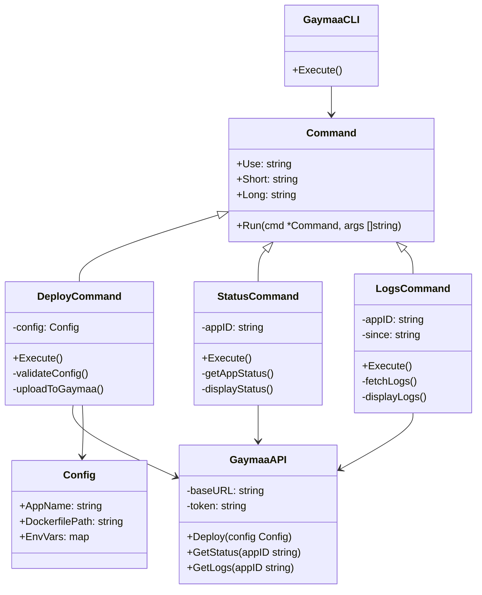
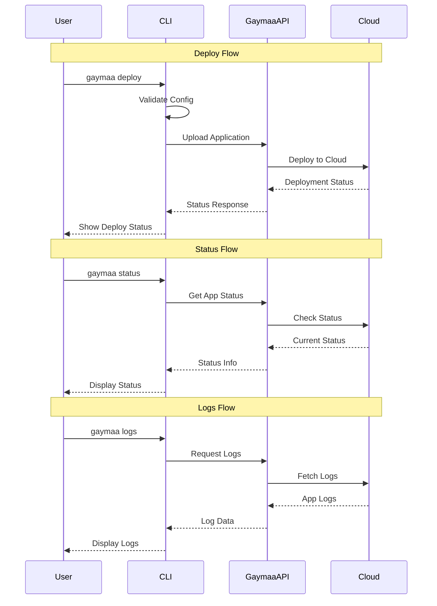

# Flow Diagram للعمليات الأساسية

# المكونات الرئيسية

1. **GaymaaCLI**
   - المسؤول عن التعامل مع أوامر المستخدم
   - يدير الـ Commands المختلفة

2. **Commands**
   - `DeployCommand`: مسؤول عن رفع التطبيق
   - `StatusCommand`: مسؤول عن عرض حالة التطبيق
   - `LogsCommand`: مسؤول عن عرض السجلات

3. **GaymaaAPI**
   - يتعامل مع API غيمة
   - يدير عمليات الـ Deploy والـ Status والـ Logs

4. **Config**
   - يحتوي على إعدادات التطبيق
   - يدير متغيرات البيئة والإعدادات

# خطوات العمل

1. المستخدم يكتب أمر من خلال الـ CLI
2. الـ CLI يتحقق من صحة الأمر والمدخلات
3. يتم تنفيذ العملية المطلوبة من خلال GaymaaAPI
4. يتم عرض النتيجة للمستخدم
